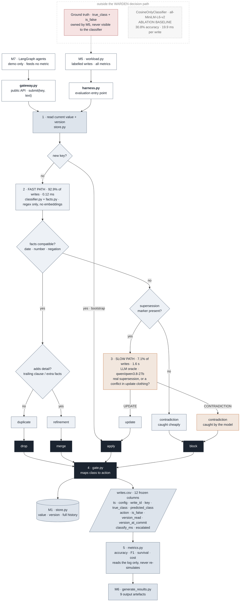

# WARDEN Decision and Evaluation Flow

## Implementation notes

- `gate.py` maps a classifier result to an action. The actual state change is performed by `Store.write()` in `store.py`; bootstrap writes are written directly by `gateway.py` or `harness.py`.
- `CosineOnlyClassifier` is an ablation baseline. The production `FastPathEscalator` in `classifier.py` uses extracted facts and supersession-marker rules before optional LLM escalation; it does not call the embedding model on its fast path.
- The percentage and latency labels reflect the published `results/metrics_table.csv` WARDEN run.
